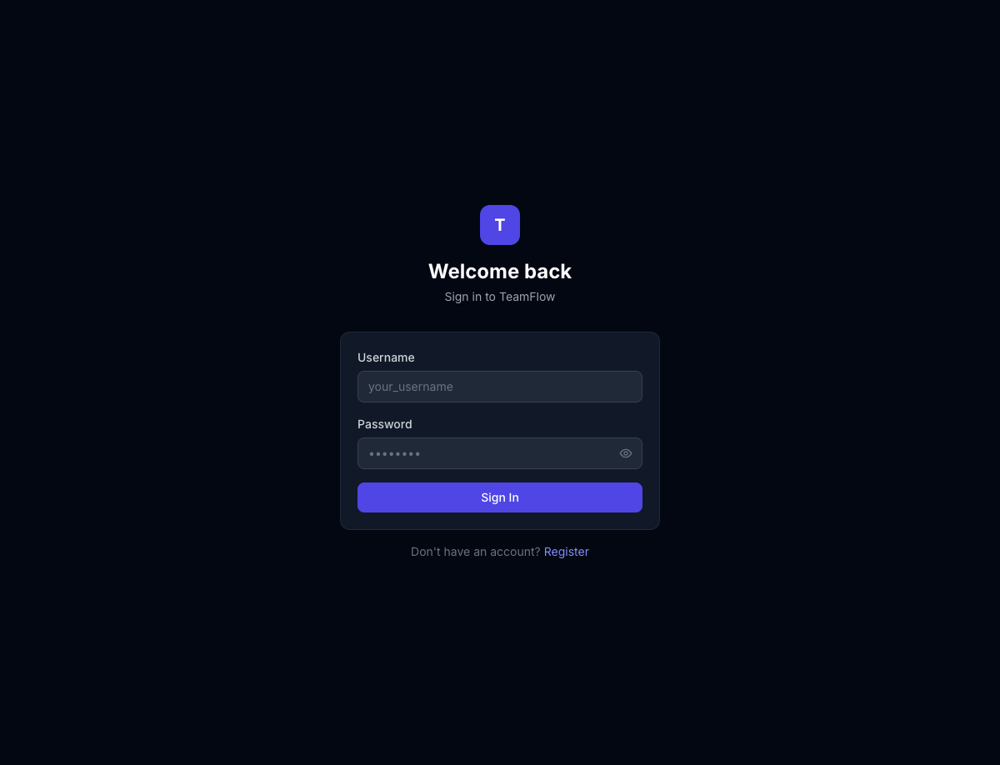
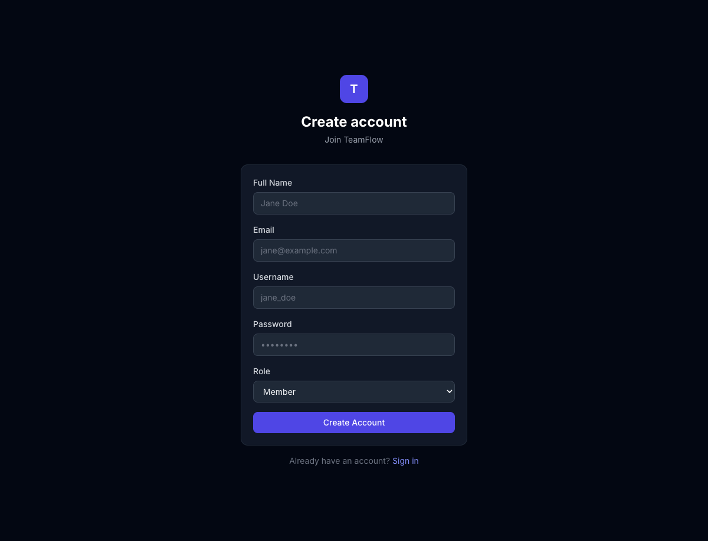
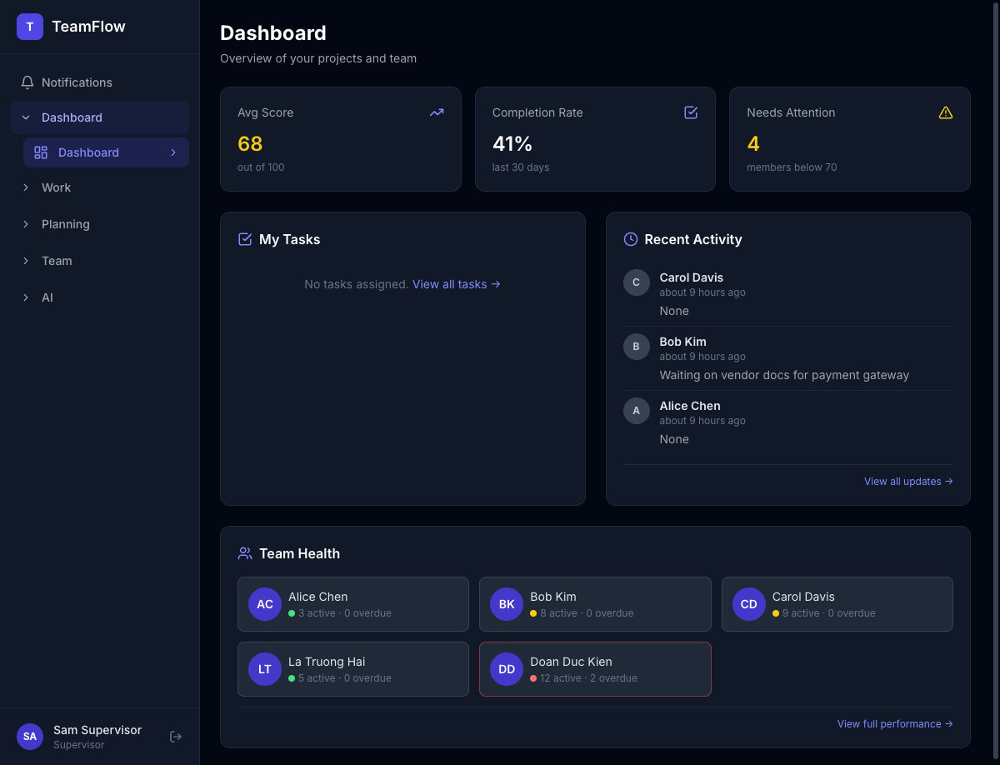
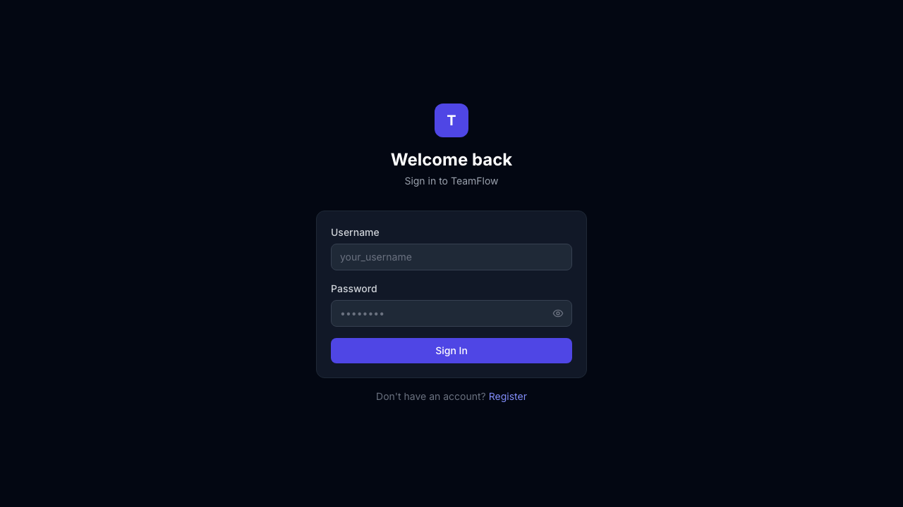
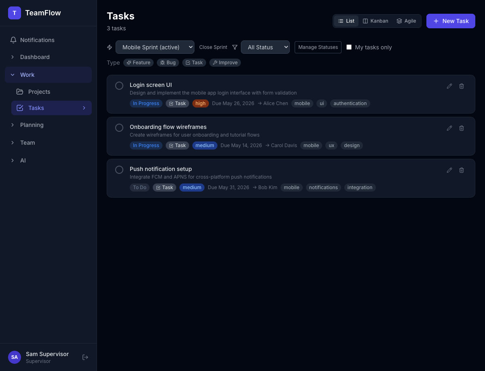

# TeamFlow User Guide

This comprehensive guide explains how to use TeamFlow for team task management, project tracking, and performance monitoring.

## Table of Contents

1. [Getting Started](#getting-started)
2. [Dashboard](#dashboard)
3. [Projects](#projects)
4. [Tasks](#tasks)
5. [Milestones](#milestones)
6. [Timeline](#timeline)
7. [Performance](#performance)
8. [Schedule](#schedule)
9. [Team](#team)
10. [Updates](#updates)
11. [Board](#board)
12. [AI Assistant](#ai-assistant)
13. [Common Workflows](#common-workflows)
14. [Advanced Features](#advanced-features)
15. [Troubleshooting](#troubleshooting)

## Getting Started

### Account Setup



1. Navigate to the TeamFlow URL (provided by your organization)
2. Click "Register" in the top navigation
3. Fill in the registration form:
    - **Email:** Your work email address
    - **Username:** Unique identifier for the system
    - **Full Name:** Your display name
    - **Password:** Minimum 8 characters (recommended: mix of letters, numbers, symbols)
4. Click "Create Account"
5. You'll be logged in automatically and redirected to the dashboard



**Note:** Your account will be created with the "member" role by default. Contact your supervisor or manager to have your role upgraded if needed.

### Login

1. Navigate to the TeamFlow URL
2. Click "Login" in the top navigation
3. Enter your email and password
4. Click "Sign In"
5. You'll be redirected to your dashboard

**Forgot Password:** If you forget your password, contact your system administrator to reset it.

### First-Time Setup

After logging in for the first time:

1. **Complete Your Profile:** Click your avatar in the top right and select "Profile"

    - Add a profile picture (optional)
    - Update your display name
    - Set your time zone
    - Add any additional information

2. **Join Your Team:** Your supervisor will assign you to a sub-team. You'll automatically see tasks and projects from your team.

3. **Explore the Dashboard:** Familiarize yourself with the dashboard sections
    - My Tasks: Your assigned work
    - Recent Activity: Team updates
    - Team Health: Supervisor-only section
    - KPI Summary: Supervisor-only section

### Understanding Your Role

Your role determines what you can see and do in TeamFlow:

**Member:**

-   View and manage your assigned tasks
-   Create tasks for yourself
-   Post standup updates
-   View your personal schedule
-   See team activity feed

**Supervisor:**

-   All member features
-   View team health metrics
-   Monitor KPI scores
-   Assign tasks to team members
-   View all team updates
-   Manage team members

**Assistant Manager:**

-   Same permissions as supervisor
-   Can share supervision responsibilities

**Manager:**

-   All features across all teams
-   Organization-wide visibility
-   Cross-team analytics
-   Manage supervisors and sub-teams

## Dashboard

The dashboard provides an at-a-glance overview of your work and team status. It's designed to show you the most important information first, helping you prioritize your day.



### What You'll See

#### My Tasks Section (All Roles)

**Purpose:** Quickly see what you need to work on today.

**Layout:**

-   Tasks displayed as cards with title, project name, priority badge, and status badge
-   Red background for overdue tasks (due date has passed)
-   Yellow background for tasks due within 48 hours
-   Gray background for normal tasks
-   Tasks are sorted by urgency: overdue first, then due-soon, then by due date

**Task Card Information:**

-   Title: Task name (clickable to view details)
-   Project: Associated project name (if any)
-   Priority: Badge showing Low/Medium/High/Critical
-   Status: Badge showing current status
-   Due Date: When the task is due (if set)

**Actions:**

-   Click task card → Opens task detail view in Tasks page
-   Hover task → Shows quick actions (edit, delete if you have permission)

**Best Practices:**

-   Start with overdue tasks (red cards)
-   Address due-soon tasks (yellow cards) next
-   Use priority badges to decide between same-urgency tasks
-   Click through to task details to see full description and subtasks

#### Team Health Section (Supervisor/Assistant Manager/Manager Only)

**Purpose:** Monitor team workload and identify at-risk members.

**Layout:**

-   Grid of team member cards
-   Each card shows:
    -   Member name and avatar
    -   Active task count
    -   Overdue task count
    -   Status indicator (red/yellow/green border)

**Status Indicators:**

-   **Red Border (At-Risk):** Member has overdue tasks OR is severely overloaded
-   **Yellow Border (Warning):** Member has 0 tasks (underloaded) OR 7+ active tasks (overloaded)
-   **Gray Border (Healthy):** Member has 1-6 active tasks with no overdue tasks

**Actions:**

-   Click member card → Opens member's performance page
-   Click section title → Opens full performance page for team

**Interpretation Guide:**

-   **Overloaded Members:** Consider redistributing their tasks to others
-   **Underloaded Members:** Assign them more work to balance team
-   **At-Risk Members:** Check in with them to remove blockers
-   **Healthy Members:** No immediate action needed

#### KPI Summary Strip (Supervisor/Assistant Manager/Manager Only)

**Purpose:** Quick overview of team performance metrics.

**Layout:**

-   Horizontal strip with three metrics:
    -   Average KPI Score (0-100)
    -   Completion Rate (percentage)
    -   Needs Attention Count

**Color Coding:**

-   **Green:** Good performance (80-100 score, high completion rate)
-   **Yellow:** Fair performance (60-79 score, moderate completion rate)
-   **Red:** Poor performance (below 60 score, low completion rate)

**Metric Details:**

**Average KPI Score:**

-   Calculated from all team members in your visible scope
-   Weighted average of workload, velocity, cycle time, on-time rate, and defect rate
-   Click to view detailed breakdown on Performance page

**Completion Rate:**

-   Percentage of tasks completed in the last 30 days
-   Calculated as: (completed tasks / total assigned tasks) × 100
-   Helps identify if team is finishing work or accumulating backlog

**Needs Attention:**

-   Count of team members with KPI score below 70
-   Click to filter Performance page to show only these members
-   These members may need coaching, support, or workload adjustment

#### Recent Activity Feed (All Roles)

**Purpose:** Stay informed about team standup updates and progress.

**Layout:**

-   Vertical list of recent standup posts
-   Each item shows:
    -   Author avatar and name
    -   Post timestamp (relative time, e.g., "2 hours ago")
    -   Post preview (first 120 characters)
    -   Post type (Daily/Weekly)

**Visibility:**

-   **Members:** See posts from own sub-team only
-   **Supervisors:** See posts from all teams they supervise
-   **Managers:** See all posts across organization

**Actions:**

-   Click activity item → Opens full post in Updates page
-   Click "View all updates" link → Navigates to Updates page

**Best Practices:**

-   Check activity feed daily to stay aligned with team progress
-   Look for blockers mentioned in posts
-   Follow up on posts that indicate risks or delays

### Dashboard Navigation

**Quick Navigation:**

-   Click any task card → Navigates to Tasks page with task selected
-   Click KPI metrics → Navigates to Performance page
-   Click team health → Navigates to Performance page filtered by team
-   Click activity item → Navigates to Updates page with post selected

**Sidebar Navigation:**

-   Use sidebar to navigate to specific pages (Tasks, Projects, etc.)
-   Dashboard is always accessible from sidebar home icon

### Dashboard Refresh

**Automatic Refresh:**

-   Dashboard refreshes automatically when you navigate to it
-   Data is fetched in real-time from the server

**Manual Refresh:**

-   Press F5 or browser refresh button
-   Click browser refresh icon

**Cache:**

-   Dashboard data is not cached; always shows latest information

## Projects

Projects organize tasks and milestones under a common goal, providing structure and context for team work. Projects help teams track progress toward specific objectives.


### Creating a Project

**Who Can Create Projects:** Supervisors, Assistant Managers, Managers

**Steps:**

1. Navigate to the Projects page from the sidebar
2. Click "New Project" button (top right)
3. Fill in the project form:
    - **Project Name:** Required. Short, descriptive name (e.g., "Mobile App v2.0", "Q1 Marketing Campaign")
    - **Description:** Optional. Detailed explanation of project goals, scope, and deliverables
    - **Color:** Required. Choose a color for visual identification in Kanban boards and timelines
4. Click "Create Project"

**Best Practices:**

-   Use clear, specific names that team members will recognize
-   Include project goals in the description for context
-   Choose distinctive colors to differentiate projects
-   Link projects to milestones before creating tasks

### Viewing Projects

**Project List View:**

-   Projects displayed as cards with:
    -   Project name (color-coded)
    -   Description (truncated if long)
    -   Task count
    -   Milestone count
-   Filter by project status (active/completed)
-   Search by project name

**Project Detail View:**

-   Click a project card to open detail view
-   Shows:
    -   Project information (name, description, color)
    -   Associated tasks
    -   Associated milestones
    -   Project timeline
    -   Team members working on project

### Managing Projects

**Editing a Project:**

1. Navigate to Projects page
2. Click the edit icon (pencil) on project card
3. Update any field
4. Click "Save Changes"

**Deleting a Project:**

1. Navigate to Projects page
2. Click the delete icon (trash) on project card
3. Confirm deletion in the dialog
4. **Warning:** Deleting a project will delete all associated tasks and milestones. This action cannot be undone.

**Project Permissions:**

-   **Members:** Can view projects in their sub-team, cannot edit or delete
-   **Supervisors:** Can create, edit, delete projects in their scope
-   **Managers:** Full access to all projects

### Project Workflows

**Starting a New Project:**

1. Create the project with clear goals
2. Create milestones for major deliverables
3. Create tasks and link to milestones
4. Assign tasks to team members
5. Track progress via timeline and Kanban board

**Project Handoff:**

1. Review all tasks and milestones
2. Ensure all tasks are either done or reassigned
3. Update project status to completed
4. Archive project (future feature)

## Tasks

Tasks are the core work items in TeamFlow. They represent individual units of work that need to be completed, tracked, and managed.


### Creating a Task

**Who Can Create Tasks:** All roles (with visibility constraints)

**Steps:**

1. Navigate to the Tasks page from the sidebar
2. Click "New Task" button (top right)
3. Fill in the task form:
    - **Title:** Required. Concise description of the work (max 200 characters)
    - **Description:** Optional. Detailed explanation of what needs to be done, acceptance criteria, and context
    - **Priority:** Required. Choose from Low, Medium, High, Critical
    - **Status:** Required. Choose from To Do, In Progress, Review, Done, Blocked
    - **Due Date:** Optional. Date when the task should be completed
    - **Assignee:** Optional. User who will complete the task (must be in your visible scope)
    - **Project:** Optional. Project this task belongs to
    - **Milestone:** Optional. Milestone this task contributes to
    - **Sprint:** Optional. Sprint this task is part of
    - **Tags:** Optional. Comma-separated keywords for categorization
    - **Estimated Hours:** Optional. Time estimate for completion
4. Click "Create Task"

**Task Assignment Rules:**

-   **Members:** Can assign tasks to themselves or other members in their sub-team
-   **Supervisors:** Can assign tasks to any user in their visible sub-teams
-   **Managers:** Can assign tasks to any user in the organization

**Best Practices:**

-   Use clear, actionable titles (e.g., "Implement login form" vs "Login stuff")
-   Include acceptance criteria in the description
-   Set realistic due dates based on complexity
-   Assign appropriate priorities based on business impact
-   Link tasks to milestones for progress tracking
-   Use tags for filtering (e.g., "frontend", "bug", "urgent")

### Using AI Task Input

**Purpose:** Create tasks faster using natural language

**Steps:**

1. Navigate to Tasks page
2. Click "New Task"
3. Click the AI button (sparkle icon) next to the title field
4. Describe your task in natural language
5. AI will extract fields automatically
6. Review and edit the extracted information
7. Click "Create Task"

**AI Capabilities:**

-   Extracts task title from description
-   Identifies priority based on language (urgent, critical, asap)
-   Estimates hours based on complexity
-   Suggests tags based on keywords

**Example Prompts:**

-   "Create a login form with email and password fields, validation, and error handling"
-   "Fix the bug where users can't upload profile pictures on mobile"
-   "Implement user authentication with JWT tokens and refresh mechanism"

**Limitations:**

-   Always review AI suggestions before creating
-   AI may miss context specific to your project
-   Manual editing is recommended for complex tasks

### Task Views

#### List View

**Purpose:** See all tasks in a tabular format for quick scanning

**Features:**

-   Sort by any column (click column header)
-   Filter by status, priority, assignee, project, milestone, sprint
-   Search by task title or description
-   Pagination for large task lists

**Columns:**

-   Title (clickable to open details)
-   Status badge
-   Priority badge
-   Assignee name
-   Project name
-   Due date
-   Created date

#### Kanban Board

**Purpose:** Visual workflow management with drag-and-drop

**Layout:**

-   Columns for each status: To Do, In Progress, Review, Done, Blocked
-   Tasks displayed as cards within columns
-   Drag tasks between columns to change status

**Task Card Information:**

-   Title
-   Priority badge
-   Assignee avatar
-   Due date (if set)
-   Tags

**Actions:**

-   Drag task to new column → Status updates automatically
-   Click task → Opens detail view
-   Hover task → Shows quick actions

**Best Practices:**

-   Keep columns organized by priority within each status
-   Move tasks to "Review" when ready for review
-   Move tasks to "Blocked" if you're waiting on something
-   Regularly review the board to identify bottlenecks

#### Sprint View

**Purpose:** Track work within specific sprints

**Features:**

-   Tasks grouped by sprint
-   Sprint progress indicators
-   Burndown visualization
-   Sprint start/end dates

**Sprint Progress:**

-   Shows percentage of tasks completed
-   Indicates if sprint is on track
-   Highlights overdue sprints

### Updating a Task

**Steps:**

1. Click on a task to open detail view
2. Edit any field
3. Click "Save Changes"

**Automatic Updates:**

-   Status changes trigger automatic KPI recalculation
-   Completion date is set when status changes to "Done"
-   Updated timestamp is recorded

### Task Priorities

**Critical:**

-   Use for: Production bugs, security issues, blocking dependencies
-   Action: Address immediately
-   Visibility: Highlighted in red

**High:**

-   Use for: Important features, urgent bugs, key deliverables
-   Action: Prioritize over medium/low tasks
-   Visibility: Highlighted in orange

**Medium:**

-   Use for: Normal features, standard bugs, regular work
-   Action: Normal priority
-   Visibility: Default styling

**Low:**

-   Use for: Nice-to-have features, optimizations, documentation
-   Action: Defer if higher priority work exists
-   Visibility: Grayed out

### Task Status Workflow

```
To Do → In Progress → Review → Done
                ↓
             Blocked
```

**Status Meanings:**

-   **To Do:** Task is ready to be started but not yet in progress
-   **In Progress:** Someone is actively working on this task
-   **Review:** Work is complete and ready for review/approval
-   **Done:** Task is complete and verified
-   **Blocked:** Task cannot proceed due to a blocker or dependency

**Workflow Best Practices:**

-   Start tasks in "To Do" when ready
-   Move to "In Progress" when you begin work
-   Move to "Review" when you believe it's complete
-   Move to "Blocked" if you're waiting on something (document the blocker in description)
-   Move back to "To Do" or "In Progress" when unblocked
-   Only move to "Done" when verified complete

## Milestones

Milestones track major deliverables and releases, providing high-level project organization and progress tracking. They help teams break down large projects into manageable phases.


### Creating a Milestone

**Who Can Create Milestones:** Supervisors, Assistant Managers, Managers

**Steps:**

1. Navigate to the Milestones page from the sidebar
2. Click "New Milestone" button (top right)
3. Fill in the milestone form:
    - **Title:** Required. Short, descriptive name (e.g., "v1.0 Launch", "Q1 Release")
    - **Description:** Optional. Detailed explanation of milestone goals, scope, and deliverables
    - **Project:** Required. Project this milestone belongs to
    - **Status:** Required. Choose from Planned, In Progress, Completed
    - **Start Date:** Required. When work on this milestone begins
    - **Due Date:** Required. When this milestone should be completed
4. Click "Create Milestone"

**Best Practices:**

-   Use clear, time-bound names (e.g., "Q1 2026 Release" vs "First Release")
-   Include success criteria in the description
-   Set realistic dates based on task estimates
-   Link tasks to milestones before setting due dates
-   Create milestones for major project phases

### Milestone Planning

Each milestone has a planning section for tracking decisions, progress, and related work.

**Planning Section Features:**

**Decisions:**

-   Document key decisions made during the milestone
-   Record rationale for important choices
-   Reference related discussions or meetings
-   Example: "Decided to use PostgreSQL over MongoDB for ACID compliance"

**Related Tasks:**

-   Automatically populated with tasks linked to this milestone
-   Shows task completion status
-   Helps track progress toward milestone completion
-   Click tasks to navigate to task details

**Progress Tracking:**

-   Progress bar shows percentage of tasks completed
-   Visual indicators for overdue milestones
-   Status badges (Planned, In Progress, Completed)
-   Timeline integration shows milestone in project context

### Viewing Milestone Progress

**Milestone Detail View:**

-   Click a milestone to open detail view
-   Shows:
    -   Milestone information (title, description, dates, status)
    -   Progress bar with completion percentage
    -   List of linked tasks with status
    -   Timeline view showing milestone in context
    -   Planning section with decisions

**Progress Indicators:**

-   **On Track:** Milestone is progressing normally toward completion
-   **At Risk:** Milestone may miss its due date based on task progress
-   **Overdue:** Milestone due date has passed and not completed
-   **Completed:** All tasks are done and milestone is marked complete

**Timeline Integration:**

-   View milestones in Gantt-style timeline
-   See task rollup under each milestone
-   Visual indicators for overdue items
-   Zoom in/out to adjust time scale
-   Click items to view details

### Managing Milestones

**Editing a Milestone:**

1. Navigate to Milestones page
2. Click the edit icon on milestone card
3. Update any field
4. Click "Save Changes"

**Deleting a Milestone:**

1. Navigate to Milestones page
2. Click the delete icon on milestone card
3. Confirm deletion in dialog
4. **Warning:** Deleting a milestone will unlink associated tasks (tasks are not deleted)

**Completing a Milestone:**

1. Navigate to Milestones page
2. Click edit icon on milestone
3. Change status to "Completed"
4. Set completed date (optional, defaults to current date)
5. Click "Save Changes"
6. All linked tasks should be reviewed and marked done if appropriate

### Milestone Workflows

**Project Planning Workflow:**

1. Create project with clear goals
2. Create milestones for major deliverables
3. Break down milestones into tasks
4. Assign tasks to team members
5. Track progress via timeline and milestone detail view
6. Adjust dates as needed based on progress

**Sprint Planning with Milestones:**

1. Create milestone for sprint goal
2. Create sprint with same date range
3. Add tasks to sprint and link to milestone
4. Track sprint progress via Sprint view
5. Monitor milestone completion via Milestone view

**Milestone Retrospective:**

1. Review milestone completion status
2. Analyze what went well
3. Identify areas for improvement
4. Document lessons learned in milestone description
5. Apply learnings to future milestones

## Timeline

The timeline provides a Gantt-style view of project progress, helping teams visualize work across time and identify dependencies and risks.


### Using the Timeline

**Purpose:** Visualize project schedule and track progress over time

**Layout:**

-   Horizontal timeline with dates across the top
-   Milestones displayed as bars with start/end dates
-   Tasks linked to milestones appear as sub-bars under their milestone
-   Planning signals (decisions, status indicators) shown as markers

**Key Views:**

**Milestone View:**

-   See all milestones with start/end dates
-   Milestone bars show duration and overlap
-   Color-coded by status (Planned, In Progress, Completed)
-   Progress indicators on each milestone bar

**Task Rollup:**

-   Tasks linked to milestones appear under their parent milestone
-   Task bars show duration and status
-   Click tasks to view details
-   Helps see which tasks contribute to each milestone

**Planning Signals:**

-   Decision markers show where key decisions were made
-   Status indicators show milestone health
-   Risk indicators highlight at-risk items

### Timeline Features

**Zoom Controls:**

-   Zoom in/out to adjust time scale
-   View by day, week, or month
-   Adjust to see more or less detail

**Filtering:**

-   Filter by project to focus on specific work
-   Filter by milestone status
-   Filter by task status

**Navigation:**

-   Click items to view details
-   Drag to pan across timeline
-   Scroll to move through time

**Visual Indicators:**

-   **Overdue items:** Red highlight
-   **At-risk items:** Yellow highlight
-   **Completed items:** Green highlight
-   **Current date:** Vertical line marker

### Timeline Use Cases

**Project Planning:**

-   Visualize project phases and milestones
-   Identify gaps or overlaps in schedule
-   Adjust dates based on task estimates

**Progress Tracking:**

-   See which milestones are on track
-   Identify overdue or at-risk items
-   Adjust resources to address delays

**Dependency Management:**

-   Visualize task dependencies (future feature)
-   Identify blocking tasks
-   Reorder work to minimize delays

**Stakeholder Communication:**

-   Share timeline with stakeholders
-   Show progress toward goals
-   Explain delays and adjustments

### Best Practices

-   **Keep milestones realistic:** Set achievable dates based on task estimates
-   **Link tasks properly:** Ensure tasks are linked to correct milestones
-   **Review regularly:** Check timeline weekly to identify risks early
-   **Update status promptly:** Mark milestones complete when done
-   **Use planning signals:** Document decisions directly in timeline

## Performance

The performance page tracks team KPI (Key Performance Indicator) metrics, helping supervisors and managers understand team productivity and identify areas for improvement.


### KPI Score Calculation

KPI scores are calculated from five weighted components:

**Workload (20%):**

-   Measures balance of active task load
-   Ideal range: 1-6 active tasks
-   Score decreases if overloaded (7+ tasks) or underloaded (0 tasks)
-   Penalizes severely overloaded or completely idle members

**Velocity (25%):**

-   Measures tasks completed in the last 30 days
-   Higher completion rate = higher score
-   Tracks productivity over time
-   Accounts for task complexity (estimated hours)

**Cycle Time (20%):**

-   Measures average time to complete tasks
-   Shorter cycle time = higher score
-   Calculates from task creation to completion
-   Excludes tasks still in progress

**On-Time (20%):**

-   Measures percentage of tasks completed by due date
-   Higher on-time rate = higher score
-   Tracks reliability and deadline adherence
-   Excludes tasks without due dates

**Defect Rate (15%):**

-   Measures bugs re-opened or tasks returned to previous status
-   Lower defect rate = higher score
-   Indicates quality of work
-   Tracks from "Done" status changes back to earlier statuses

### Viewing Performance

**Who Can View Performance:**

-   **Members:** View only their own performance
-   **Supervisors:** View performance of users in their visible sub-teams
-   **Managers:** View performance of all users

**Performance Page Layout:**

**Team Overview:**

-   Average KPI score across team
-   Overall completion rate
-   Team health summary
-   Quick statistics

**Individual Performance:**

-   List of team members with their KPI scores
-   Each member shows:
    -   KPI score (0-100)
    -   Component breakdown (workload, velocity, cycle time, on-time, defect rate)
    -   Active task count
    -   Completion rate
    -   Status indicator (healthy/at-risk)

**Trends:**

-   Performance over time
-   KPI score history
-   Identify improving or declining performance
-   Date range filters (7 days, 30 days, 90 days)

**Needs Attention:**

-   Filter to show only members with KPI < 70
-   Quick access to at-risk team members
-   Helps prioritize coaching and support

### Performance Categories

**80-100: Good Performance**

-   Member is performing well
-   Workload balanced
-   High completion rate
-   Good on-time delivery
-   Low defect rate

**60-79: Fair Performance**

-   Room for improvement
-   May have moderate issues
-   Consider coaching or workload adjustment
-   Monitor for decline

**Below 60: At Risk**

-   Performance concerns
-   Needs attention and support
-   May be overloaded or underloaded
-   Investigate root cause

### Using Performance Data

**For Supervisors:**

-   Identify overloaded members and redistribute work
-   Recognize high performers
-   Coach at-risk team members
-   Adjust team composition based on metrics
-   Set performance goals with team

**For Managers:**

-   Compare performance across teams
-   Identify systemic issues
-   Allocate resources effectively
-   Track organizational trends
-   Make data-driven decisions

**For Members:**

-   Track own performance over time
-   Identify areas for improvement
-   Set personal goals
-   Understand how metrics are calculated

### Performance Best Practices

-   **Review regularly:** Check performance weekly to identify trends
-   **Context matters:** Consider project complexity and external factors
-   **Focus on trends:** Look at performance over time, not single snapshots
-   **Coach, don't punish:** Use metrics to support, not punish
-   **Set realistic goals:** Base targets on historical data
-   **Communicate openly:** Discuss performance with team members

### KPI Recalculation

**Automatic Updates:**

-   KPI scores recalculate automatically when tasks change status
-   Updates happen in real-time
-   No manual refresh needed

**Timing:**

-   Small changes update immediately
-   Large-scale updates may take up to 24 hours
-   Daily recalculation ensures accuracy

**Data Freshness:**

-   KPI scores always reflect latest task data
-   Historical data is preserved for trend analysis
-   No caching or stale data issues

## Schedule

The schedule is a personal calendar for events, meetings, and knowledge sharing sessions. It helps you manage your time and coordinate with your team.



### Creating an Event

**Who Can Create Events:** All roles (for personal events)
**Who Can Create Knowledge Sessions:** Supervisors, Assistant Managers, Managers

**Steps:**

1. Navigate to the Schedule page from the sidebar
2. Click on a date in the calendar or "New Event" button
3. Fill in the event form:
    - **Title:** Required. Short description (e.g., "Team Standup", "Project Review")
    - **Description:** Optional. Details about the event
    - **Start Date/Time:** Required. When the event begins
    - **End Date/Time:** Required. When the event ends
    - **Location:** Optional. Physical location or meeting link
    - **Attendees:** Optional. Team members invited to the event
4. Click "Create Event"

**Best Practices:**

-   Use clear, specific titles
-   Include meeting links in description
-   Set appropriate duration
-   Invite relevant attendees
-   Add reminders if available

### Calendar Views

**Month View:**

-   Full month calendar grid
-   Shows all events for the month
-   Click a day to see that day's events
-   Navigate between months

**Week View:**

-   Weekly schedule with time slots
-   Shows events by day and time
-   Useful for planning your week
-   Drag events to reschedule (future feature)

**Day View:**

-   Detailed daily agenda
-   Shows events in chronological order
-   Time slots for the day
-   Useful for daily planning

### Knowledge Sessions

**Purpose:** Schedule knowledge sharing sessions for team learning

**Who Can Create:** Supervisors, Assistant Managers, Managers

**Session Details:**

-   Title and description of the topic
-   Date and time
-   Attendees (who should attend)
-   Visibility (who can see the session)
-   Reminder settings

**Visibility Rules:**

-   **Public:** All team members can see
-   **Sub-Team:** Only members of your sub-team can see
-   **Private:** Only invited attendees can see

**Reminder Settings:**

-   Send reminder 1 day before
-   Send reminder 1 hour before
-   Send reminder 15 minutes before

**Best Practices:**

-   Schedule sessions in advance
-   Include session agenda in description
-   Record sessions for later viewing (future feature)
-   Share materials after session
-   Gather feedback after session

### Event Management

**Editing an Event:**

1. Navigate to Schedule page
2. Click on the event
3. Click "Edit"
4. Update any field
5. Click "Save"

**Deleting an Event:**

1. Navigate to Schedule page
2. Click on the event
3. Click "Delete"
4. Confirm deletion

**Recurring Events:** (future feature)

-   Set daily, weekly, or monthly recurrence
-   Specify end date or number of occurrences
-   Edit individual occurrences or entire series

## Team

View team members and their workload to understand team capacity and identify who can take on new work.


### Team Overview

**Who Can View Team:**

-   **Members:** View team members in their sub-team only
-   **Supervisors:** View members in their visible sub-teams
-   **Managers:** View all team members

**Team List Shows:**

-   Member name and avatar
-   Current task assignments (count)
-   Workload status (overloaded/healthy/underloaded)
-   KPI score
-   Sub-team membership

**Workload Status:**

-   **Overloaded:** 7+ active tasks
-   **Healthy:** 1-6 active tasks
-   **Underloaded:** 0 active tasks

### Member Details

**Click a member to see:**

**Assigned Tasks:**

-   List of all tasks currently assigned
-   Task status and priority
-   Due dates
-   Project affiliation

**Recent Activity:**

-   Recent task status changes
-   Standup posts
-   Other activity

**Performance History:**

-   KPI score over time
-   Component breakdown
-   Trends and patterns

**Contact Information:**

-   Email address
-   Role and sub-team
-   Other details

### Team Management

**For Supervisors:**

-   View team workload distribution
-   Identify overloaded or underloaded members
-   Make informed task assignment decisions
-   Track team performance
-   Plan resource allocation

**For Managers:**

-   View organization-wide team composition
-   Compare performance across teams
-   Identify top performers
-   Plan team structure changes
-   Make hiring decisions

**For Members:**

-   See who else is on your team
-   Understand team capacity
-   Know who to contact for help
-   Identify subject matter experts

## Updates

Share daily or weekly standup updates to keep the team informed about progress, blockers, and plans.


### Creating an Update

**Who Can Create Updates:** All roles

**Steps:**

1. Navigate to the Updates page from the sidebar
2. Click "New Update" button
3. Select update type:
    - **Daily:** For daily standup updates
    - **Weekly:** For weekly summaries
4. Fill in the update fields:
    - **Pending Tasks:** Tasks you're currently working on
    - **Completed Tasks:** Tasks you finished since last update
    - **Blockers:** Anything preventing you from making progress
    - **Notes:** Additional information, plans, or concerns
5. Click "Post Update"

**Update Visibility:**

-   Updates are visible to your sub-team
-   Supervisors see updates from all teams they supervise
-   Managers see all updates

**Task Snapshot:**

-   When you post an update, TeamFlow takes a snapshot of your current tasks
-   This snapshot is saved with the update
-   Provides historical context for what you were working on

### Activity Feed

**Viewing Updates:**

-   All team updates appear in chronological order
-   Most recent updates appear first
-   Each update shows:
    -   Author name and avatar
    -   Timestamp (relative time)
    -   Update type (Daily/Weekly)
    -   Preview of content

**Filtering:**

-   Filter by author
-   Filter by date range
-   Filter by update type

**Editing Updates:**

-   You can edit your own updates
-   Click the edit icon on your update
-   Make changes and save
-   Edit history is preserved (future feature)

**Deleting Updates:**

-   You can delete your own updates
-   Click the delete icon
-   Confirm deletion

### Best Practices

**Daily Updates:**

-   Post daily, even if no significant progress
-   Be concise and focused
-   Clearly state blockers
-   Mention what you need help with

**Weekly Updates:**

-   Summarize the week's accomplishments
-   Highlight key learnings
-   Plan for the coming week
-   Reflect on overall progress

**Blockers:**

-   Always mention blockers in updates
-   Be specific about what's blocking you
-   Suggest potential solutions
-   Request help if needed

**Team Communication:**

-   Read team updates regularly
-   Respond to blockers when you can help
-   Stay informed about team progress
-   Use updates to coordinate work

## Board

The Team Weekly Board is a collaborative planning surface for sharing information, decisions, and updates with the team.


### Creating a Weekly Post

**Who Can Create Posts:** All roles

**Steps:**

1. Navigate to the Board page from the sidebar
2. Click "New Post" button
3. Select the week for the post
4. Write content in Markdown format
5. Click "Post"

**Markdown Support:**

-   Headers (# ## ###)
-   Bold (**text**) and italic (_text_)
-   Lists (- item, 1. item)
-   Links [text](url)
-   Code (`code` or `code`)
-   Blockquotes (> text)

**Post Visibility:**

-   Posts are visible to your sub-team
-   Supervisors see posts from all teams they supervise
-   Managers see all posts

### Board Features

**Week Navigation:**

-   Navigate between weeks using arrow buttons
-   Jump to current week
-   Select specific week from calendar

**AI Summaries:**

-   AI generates summaries of posts
-   Summaries highlight key points
-   Helps quickly understand post content
-   Available for longer posts

**Appending to Posts:**

-   Add to existing posts without editing
-   Useful for incremental updates
-   Preserves original content
-   Shows who added what and when

**Search:** (future feature)

-   Search across all posts
-   Find specific topics or decisions
-   Filter by author or date

### Best Practices

**Weekly Planning:**

-   Use the board for weekly planning sessions
-   Document decisions and action items
-   Share learnings and retrospectives
-   Keep posts focused and organized

**Content Structure:**

-   Use headers to organize content
-   Use lists for action items
-   Be concise but comprehensive
-   Include dates for time-sensitive items

**Collaboration:**

-   Encourage team members to contribute
-   Use AI summaries for quick reviews
-   Append updates rather than editing
-   Reference related posts

**Archiving:** (future feature)

-   Archive old posts to keep board clean
-   Keep accessible for reference
-   Archive by month or quarter

## AI Assistant

TeamFlow AI helps with task management and planning using natural language processing.



### AI Features

**Task Input:**

-   Natural language task creation
-   Automatic field extraction (title, priority, due date)
-   Smart suggestions based on context
-   Reduces time to create tasks

**Task Breakdown:**

-   Describe a feature or large task
-   AI suggests subtasks
-   Estimates hours for each subtask
-   Helps break down complex work

**Project Summary:**

-   Get AI-generated project status
-   Summarizes progress across tasks and milestones
-   Identifies risks and blockers
-   Suggests next actions

### Using AI Assistant

**AI Task Input:**

1. Click "New Task"
2. Click AI button (sparkle icon)
3. Describe task in natural language
4. AI extracts fields automatically
5. Review and edit suggestions
6. Click "Create Task"

**AI Task Breakdown:**

1. Create a parent task
2. Click "AI Breakdown"
3. Describe the feature in detail
4. AI suggests 3-8 subtasks
5. Adjust subtasks as needed
6. Create all subtasks with one click

**AI Project Summary:**

1. Navigate to project detail view
2. Click "AI Summary"
3. AI generates comprehensive summary
4. Review and use the insights
5. Share with team if needed

### AI Capabilities

**Natural Language Understanding:**

-   Understands task descriptions
-   Extracts key information
-   Identifies priority and urgency
-   Recognizes task type (feature, bug, etc.)

**Context Awareness:**

-   Uses project context for suggestions
-   Learns from your task patterns
-   Adapts to your terminology
-   Improves over time

**Smart Suggestions:**

-   Suggests appropriate priorities
-   Estimates time based on complexity
-   Identifies related tasks
-   Recommends tags

### Limitations

**Always Review:**

-   AI suggestions are not perfect
-   Always review before accepting
-   Edit fields as needed
-   Use your judgment

**Context Matters:**

-   AI may miss project-specific context
-   Provide clear, detailed descriptions
-   Include relevant background information
-   Be specific about requirements

**Not a Replacement:**

-   AI assists, doesn't replace human judgment
-   Use AI to speed up work, not automate decisions
-   Apply domain knowledge to AI suggestions
-   Maintain accountability for quality

## Role-Specific Features

### Members

**Core Capabilities:**

-   View and update assigned tasks
-   Create tasks for yourself or sub-team members
-   Post daily and weekly standup updates
-   View personal schedule and events
-   See team activity feed
-   View own KPI performance
-   Access Kanban board and task views

**What You Can't Do:**

-   View other members' workload or performance
-   Create projects or milestones
-   Assign tasks to users outside your sub-team
-   View team health or KPI summary
-   Access organization-wide analytics

**Daily Workflow:**

1. Check dashboard for your tasks
2. Update task status as you work
3. Post daily standup update
4. Review team activity feed
5. Check schedule for upcoming events

### Supervisors

**All Member Features Plus:**

**Team Management:**

-   View team health dashboard
-   See workload distribution across team
-   Monitor KPI scores for team members
-   Identify at-risk team members
-   Assign tasks to team members in your scope

**Project Management:**

-   Create and manage projects
-   Create and manage milestones
-   Link tasks to milestones
-   View timeline and project progress

**Visibility:**

-   View all tasks in your sub-teams
-   View tasks in sub-teams you supervise
-   See all team updates from supervised teams
-   Access performance metrics for your scope

**Decision Making:**

-   Redistribute workload to balance team
-   Coach underperforming team members
-   Recognize high performers
-   Adjust project timelines based on progress
-   Make informed hiring decisions

### Assistant Managers

**All Supervisor Features:**

-   Same permissions as supervisors
-   Can share supervision responsibilities
-   Visibility spans assigned sub-teams
-   Can collaborate with other supervisors

**Use Cases:**

-   Shared leadership models
-   Large teams requiring multiple supervisors
-   Cross-functional team oversight
-   Backup supervision coverage

### Managers

**All Features Across All Teams:**

**Organization-Wide Visibility:**

-   View all users, tasks, projects, milestones
-   Access performance metrics for entire organization
-   Compare performance across teams
-   View all updates across organization

**Strategic Management:**

-   Manage supervisors and sub-teams
-   Assign supervisor roles
-   Create organizational projects
-   Make resource allocation decisions
-   Set organizational goals

**Analytics:**

-   Cross-team performance comparison
-   Organizational trends and patterns
-   Resource utilization analysis
-   Capacity planning
-   Strategic reporting

**Governance:**

-   Override visibility restrictions (future)
-   Manage user roles and permissions
-   Configure organization settings
-   Audit access and changes

## Tips and Best Practices

### Task Management

**Break Down Large Tasks:**

-   Split complex tasks into smaller, manageable subtasks
-   Each subtask should be completable in 1-2 days
-   Link subtasks to parent task for tracking
-   This improves estimation and progress tracking

**Set Realistic Due Dates:**

-   Consider task complexity and dependencies
-   Buffer time for unexpected issues
-   Consult with assignees before setting dates
-   Adjust dates as needed based on progress

**Update Status Regularly:**

-   Update task status at least daily
-   Move tasks to "Review" when complete
-   Mark tasks "Blocked" when waiting on something
-   Keep status accurate for KPI calculations

**Use Tags for Categorization:**

-   Create consistent tag conventions (e.g., "frontend", "backend", "bug", "feature")
-   Use tags to filter and search tasks
-   Tags help with reporting and analysis
-   Keep tags focused and meaningful

**Assign Clear Priorities:**

-   Use Critical sparingly (only for emergencies)
-   High priority for important but not urgent work
-   Medium for normal tasks
-   Low for nice-to-have items
-   Review priorities regularly

### Team Collaboration

**Post Daily Standup Updates:**

-   Post every day, even if no progress
-   Be concise and focused
-   Clearly state blockers
-   Mention what you need help with
-   This keeps everyone aligned

**Keep Task Descriptions Clear:**

-   Include acceptance criteria
-   Add context and background
-   Reference related documents
-   Be specific about requirements
-   Update description if scope changes

**Communicate Blockers Early:**

-   Don't wait until it's too late
-   Be specific about what's blocking you
-   Suggest potential solutions
-   Request help if needed
-   Update task status to "Blocked"

**Use @mentions for Attention:** (coming soon)

-   @mention team members in task comments
-   Use @mentions in updates to get attention
-   Be respectful with mentions
-   Follow up if no response

**Review Team Performance Regularly:**

-   Check performance page weekly
-   Discuss metrics in 1:1 meetings
-   Celebrate successes
-   Address concerns constructively
-   Use data to support decisions

### Project Planning

**Use Milestones for Major Deliverables:**

-   Create milestones for key phases
-   Link tasks to appropriate milestones
-   Set realistic milestone dates
-   Track milestone progress
-   Celebrate milestone completions

**Link Tasks to Milestones:**

-   Every task should link to a milestone
-   This shows progress toward goals
-   Helps with timeline visualization
-   Makes project reporting easier
-   Identifies orphan tasks

**Review Timeline Regularly:**

-   Check timeline weekly for risks
-   Adjust dates based on progress
-   Identify bottlenecks early
-   Communicate delays to stakeholders
-   Update plans as needed

**Adjust Plans Based on Progress:**

-   Be flexible with dates
-   Reallocate resources if needed
-   Cut scope if timeline is tight
-   Add scope if ahead of schedule
-   Document reasons for changes

**Document Decisions in Milestones:**

-   Record key decisions in milestone planning
-   Include rationale and context
-   Reference related discussions
-   This provides audit trail
-   Helps with retrospectives

## Common Workflows

### Daily Standup Workflow

**For Team Members:**

1. Check dashboard for your tasks
2. Review yesterday's completed tasks
3. Identify today's priorities
4. Note any blockers
5. Post daily update with:
    - Pending tasks
    - Completed tasks
    - Blockers
    - Notes

**For Supervisors:**

1. Review all team updates
2. Identify blockers to address
3. Check team health dashboard
4. Rebalance workload if needed
5. Schedule 1:1s for at-risk members

### Sprint Planning Workflow

1. Review project timeline and upcoming milestones
2. Identify tasks for current sprint
3. Create or update sprint with date range
4. Assign tasks to team members
5. Set realistic due dates
6. Link tasks to milestones
7. Share sprint plan with team
8. Track progress via Sprint view

### Task Assignment Workflow

**For Supervisors:**

1. Review team workload in Team view
2. Identify available capacity
3. Consider member skills and interests
4. Assign task to appropriate member
5. Communicate expectations clearly
6. Set up follow-up check-ins
7. Monitor progress via dashboard

### Code Review Workflow

1. Developer marks task as "In Progress"
2. Developer completes work
3. Developer moves task to "Review"
4. Reviewer reviews task
5. If approved: move to "Done"
6. If changes needed: move back to "In Progress" with comments
7. Repeat until approved

### Project Handoff Workflow

1. Review all tasks and milestones
2. Ensure all tasks are done or reassigned
3. Update project status to completed
4. Document final state
5. Share results with stakeholders
6. Conduct retrospective
7. Archive project (future feature)

## Advanced Features

### Custom Statuses (future feature)

Create custom task statuses beyond the default ones:

-   Define status names
-   Set status colors
-   Configure status transitions
-   Use for specific workflows (e.g., "QA", "Deployed")

### Custom Fields (future feature)

Add custom fields to tasks, projects, or milestones:

-   Text fields for additional information
-   Number fields for metrics
-   Date fields for custom dates
-   Dropdown fields for standardized values

### Task Dependencies (future feature)

Define relationships between tasks:

-   Task A must complete before Task B starts
-   Task B blocks Task C
-   Visualize dependency chains
-   Identify critical path

### Saved Filters (future feature)

Save frequently used filter combinations:

-   Quick access to common views
-   Share saved filters with team
-   Create personal filter presets
-   Reduce repetitive filter setup

### Bulk Actions (future feature)

Perform actions on multiple tasks at once:

-   Bulk assign tasks
-   Bulk change status
-   Bulk update due dates
-   Bulk add tags
-   Bulk delete

### Export and Reporting (future feature)

Export data for external use:

-   Export tasks to CSV
-   Export performance metrics
-   Generate PDF reports
-   Create custom reports
-   Schedule automated reports

## Troubleshooting

### Common Issues

**Can't see a task:**

-   Check if you're assigned to it
-   Verify project visibility (is it in your sub-team?)
-   Check if task is in a supervised sub-team (for supervisors)
-   Contact your supervisor if you believe it's an error
-   Verify your sub-team assignment is correct

**KPI score seems wrong:**

-   Allow 24 hours for recalculation after task changes
-   Check task completion dates are accurate
-   Verify no data entry errors in task status
-   Review KPI component breakdown for issues
-   Contact supervisor if score still seems incorrect after 24 hours

**Can't assign task to user:**

-   Check if user is in your visible scope
-   Verify user exists in your sub-team or supervised sub-teams
-   Members can only assign within their sub-team
-   Contact manager for cross-team assignments
-   Check if user account is active

**Dashboard not loading:**

-   Refresh the page (F5)
-   Check your internet connection
-   Clear browser cache
-   Try a different browser
-   Contact IT if issue persists

**Tasks not updating:**

-   Check for error messages
-   Verify you clicked "Save Changes"
-   Check your internet connection
-   Try reloading the page
-   Contact support if issue persists

**Can't create project:**

-   Verify you have supervisor role or higher
-   Check if you're logged in correctly
-   Try logging out and back in
-   Contact your manager if role needs upgrade
-   Check browser console for errors

### Performance Issues

**Slow page loads:**

-   Check your internet connection
-   Clear browser cache
-   Close other browser tabs
-   Try during off-peak hours
-   Contact IT if issue persists across users

**Dashboard taking long to load:**

-   Reduce number of tasks displayed
-   Filter by date range
-   Check if team has excessive tasks
-   Contact support for optimization
-   Consider archiving old tasks (future feature)

### Access Issues

**Can't log in:**

-   Verify email and password are correct
-   Check if Caps Lock is on
-   Reset password if forgotten
-   Contact administrator if account is locked
-   Try a different browser

**Role permissions insufficient:**

-   Contact your supervisor or manager
-   Request role upgrade if justified
-   Verify your role is correctly assigned
-   Check if you're in the correct sub-team
-   Contact IT for account issues

**Seeing wrong data:**

-   Verify sub-team assignment is correct
-   Check if you have the right role
-   Clear browser cache and reload
-   Log out and log back in
-   Contact support if issue persists

### Data Issues

**Lost task data:**

-   Check task history (future feature)
-   Contact supervisor for assistance
-   Check if task was accidentally deleted
-   Restore from backup if available
-   Contact IT for data recovery

**Incorrect KPI calculation:**

-   Wait 24 hours for recalculation
-   Verify task statuses are accurate
-   Check due dates are correct
-   Review component breakdown for errors
-   Report issue to support with details

### Browser Compatibility

**Features not working:**

-   Try a modern browser (Chrome, Firefox, Safari)
-   Update browser to latest version
-   Disable browser extensions
-   Try incognito/private mode
-   Contact support with browser details

**Mobile issues:**

-   Use desktop browser for full features
-   Mobile view is optimized for viewing only
-   Some features may not work on mobile
-   Report mobile-specific issues to support
-   Use responsive design features where available

## Getting Help

### Support Channels

For issues or questions:

-   **Contact your team supervisor:** First point of contact for most issues
-   **Check with your manager:** For access issues or role changes
-   **Report bugs to the development team:** Through your organization's bug tracking system
-   **Contact IT:** For technical issues with browser, network, or account access

### When to Contact Support

**Contact your supervisor for:**

-   Task assignment issues
-   Project or milestone questions
-   Team workload concerns
-   KPI score questions
-   Visibility issues

**Contact your manager for:**

-   Role and permission changes
-   Sub-team assignment changes
-   Cross-team collaboration requests
-   Organization-wide issues
-   Strategic questions

**Contact IT for:**

-   Login and account issues
-   Browser compatibility problems
-   Network connectivity issues
-   Performance problems affecting multiple users
-   Security concerns

**Contact development team for:**

-   Bug reports and feature requests
-   UI/UX feedback
-   Documentation corrections
-   Integration issues
-   API questions

### Reporting Bugs

When reporting bugs, include:

-   Description of the issue
-   Steps to reproduce
-   Expected behavior
-   Actual behavior
-   Browser and version
-   Screenshots if applicable
-   Error messages from browser console

### Feature Requests

For feature requests:

-   Describe the problem you're trying to solve
-   Explain why the feature would help
-   Provide use cases
-   Suggest potential solutions if you have ideas
-   Prioritize importance (critical, important, nice-to-have)
